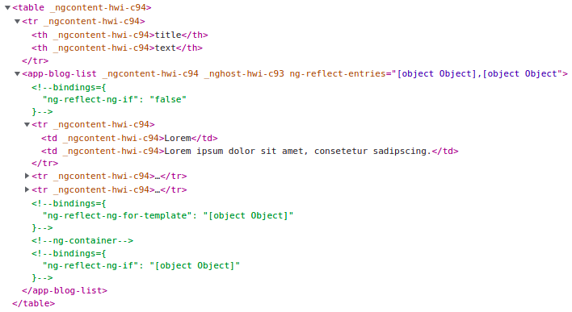

# 14 &bull; `TemplateRef` fails in `table`

Similar to the last example in [branch 13](../m013), but with `<ng-container>`

## [blog-entry](blog-entry)

[blog-entry.component.ts](blog-entry/blog-entry.component.ts) is like in the last branch.<br>
The default template is [blog-entry.component.html](blog-entry/blog-entry.component.html).

## [blog-list](blog-list)

### [blog-list.component.ts](blog-list/blog-list.component.ts)

This is basically like in the last branch, just without the addition template.

```
@ContentChild('customTemplate') custom?: TemplateRef<any>;
```

### [blog-list.component.html](blog-list/blog-list.component.html)

`*ngIf` needs to be in a tag. While a `<div>` was used in the last branch, `<ng-container>` is used here.<br>
The hope was that there would be no alien tag between `<table>` and `<tr>`, but there is.

```html
<ng-container *ngIf="custom">
  <ng-template ngFor [ngForOf]="entries" [ngForTemplate]="custom"></ng-template>
</ng-container>
```

## [main](main)

[main.component.ts](main/main.component.ts) is basically like in the last branch.
`listEntries` is defined in the constructor.

### [main.component.html](main/main.component.html)

```html
<table>
  
  <tr> <th>title</th> <th>text</th> </tr>
  
  <app-blog-list [entries]="listEntries">
    <ng-template let-entry #customTemplate>
      <tr> <td>{{entry.title}}</td> <td>{{entry.text}}</td> </tr>
    </ng-template>
  </app-blog-list>
  
</table>
```

This is how the resulting HTML looks:


